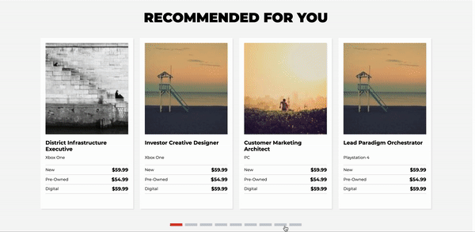

# Recommended Services
> Product recomendation carousel. Displays item details such as price and triggers transitions on button click.



## Webpage Demo


## Requirements
- Node 12.0.0
- MongoDB 4.2.6
## Development
### Installing Dependencies
From within the root directory:
```sh
npm install -g webpack
npm install
```
### Starting Up
Create and Seed the database:
```sh
npm run seed
```
Start WebPack for Development and run Nodemon
```sh
npm run build:dev
```
Start Express Server on localhost:3005
```sh
npm run start:dev
```
## Production
### Starting Up
Create and Seed the database:
```sh
npm run seed
```
Render Bundle
```sh
npm run build
```
Start Express Server
```sh
npm start
```

